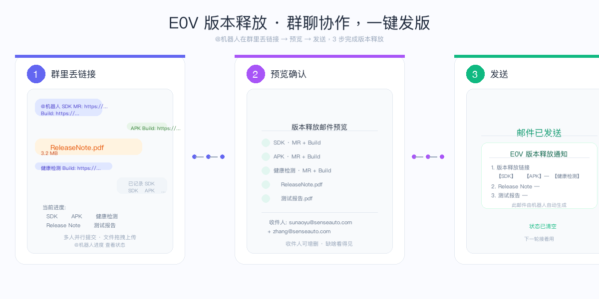
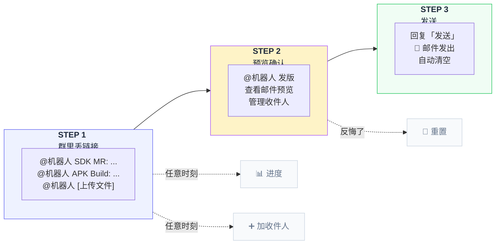
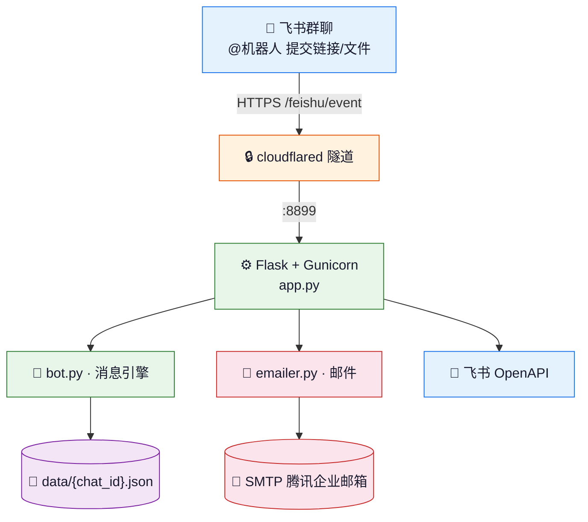
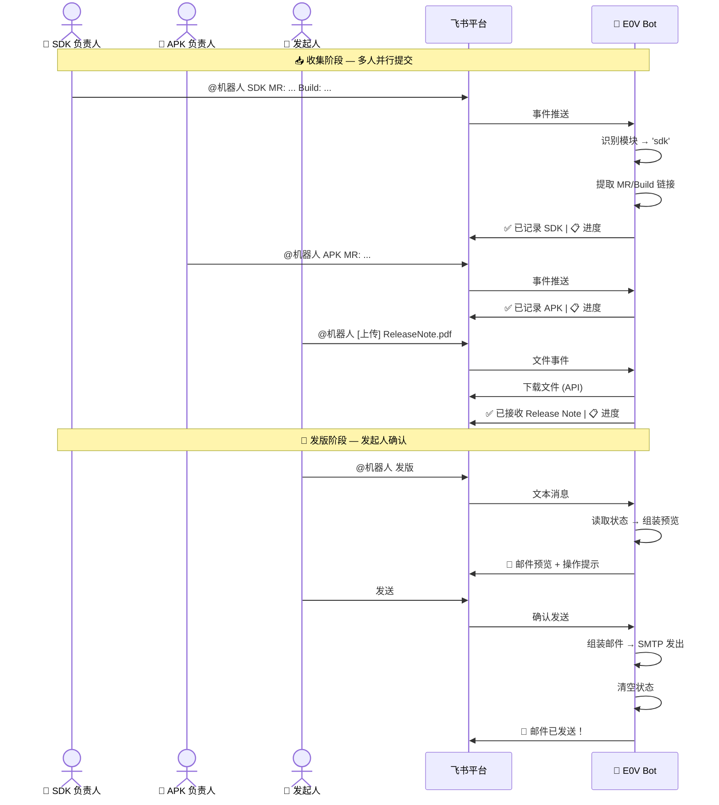

# 🚀 E0V 版本释放机器人

<p align="center">
  
</p>

> **发版，一句话的事。**  
> 飞书群聊协作，@机器人丢链接 → 预览 → 发送，3 步完成版本释放邮件。

---

## 😫 以前 vs 😎 现在

| 😫 以前 | 😎 现在 |
|---------|---------|
| 群聊里来回 @人催链接 | 各负责人群里丢链接即可 |
| 手动复制粘贴整理邮件 | 机器人自动收集、汇总 |
| 容易漏模块、漏链接 | 进度一目了然，缺啥看得到 |
| 文件传来传去版本混乱 | 文件拖进群自动识别分类 |
| 发完还得手动归档 | 说「发版」→「发送」，完事 |

---

## 📋 就 3 步



多人并行提交，发起人最后确认发送，跟群接龙一样简单。

---

## ✨ 为什么好用

### 🧠 智能模块识别

发「健康检测：」自动归到健康检测模块，不会被 URL 里的 Domain 干扰。SDK / APK 同样自动识别。**两阶段检测**：先看人写的前缀（去 URL），再全文兜底。

### 👥 多人并行协作

SDK 负责人、APK 负责人、测试负责人各发各的，互不干扰。进度实时可见，谁没交一眼就知道。

### 📎 文件自动分类

拖个文件进群，机器人自动判断是 Release Note 还是测试报告，不需要手动标注。

### 📋 进度实时可见

随时发「进度」查看收集状态：

```
📋 当前进度:
  ✅ SDK
  ⬜ APK
  ✅ 健康检测
  ⬜ Release Note
  ✅ 测试报告
```

差啥补啥，清清楚楚。

### 📧 标准化邮件模板

三段式结构：版本链接 + Release Note + 测试报告。模块不发则自动标注「本次不发」，附件 Base64 打包。

```
To: sunaoyu@senseauto.com
Subject: E0V 版本释放通知

1. 版本释放链接
   【SDK】MR: xxx  Build: xxx
   【APK】本次不发
   【健康检测】MR: xxx

2. Release Note — 附件: RN.pdf
3. 测试报告 — 附件: 测试报告.pdf
```

### 🔄 即用即走

发送后自动清空状态，下一轮接着用。收件人列表可精细管理，增删随时生效。

---

## 📖 命令速查

| 命令 | 做什么 |
|------|--------|
| `@机器人 SDK MR: https://...` | 提交 SDK 模块的 MR 和 Build 链接 |
| `@机器人 APK MR: https://...` | 提交 APK 模块的 MR 和 Build 链接 |
| `@机器人 健康检测 MR: https://...` | 提交健康检测模块链接 |
| `@机器人 [上传文件]` | 上传 Release Note 或测试报告 |
| `@机器人 发版` | 预览版本释放邮件 |
| `发送` | 确认发送邮件 |
| `预览` | 查看完整邮件详情 |
| `进度` | 查看各模块收集状态 |
| `加收件人 xxx@email` | 添加邮件收件人 |
| `删收件人 xxx@email` | 删除收件人 |
| `收件人` | 查看收件人列表 |
| `重置` | 清空全部重新开始 |
| `帮助` | 显示使用说明 |

---

## 🏗️ 系统架构



### 技术栈

| 层 | 技术 |
|----|------|
| Web 框架 | Flask + Gunicorn (Python) |
| HTTPS 隧道 | cloudflared (免费) |
| 消息平台 | 飞书开放平台 (tenant_access_token) |
| 邮件 | SMTP STARTTLS (腾讯企业邮箱) |
| 存储 | JSON 文件 (按 chat_id 隔离) |

### 核心文件

| 文件 | 职责 |
|------|------|
| `app.py` | Flask 入口，事件路由，@提及检测，多模块拆分 |
| `bot.py` | 消息解析、两阶段模块识别、状态管理、命令处理 |
| `emailer.py` | SMTP 邮件发送，多收件人 + 附件打包 |
| `start.sh` | 部署启动脚本，gunicorn 后台运行 |

---

## 🔄 完整交互时序



---

## 🚢 部署

```bash
# 服务器: 43.159.43.36
# 路径: /root/e0v-release-bot/

cd /root/e0v-release-bot && bash start.sh

# HTTPS 隧道（飞书事件订阅强制 HTTPS）
cloudflared tunnel --url http://localhost:8899
# → 更新飞书后台「事件订阅」→「请求网址」
```

| 环境变量 | 说明 |
|----------|------|
| `FEISHU_APP_SECRET` | 飞书应用 Secret |
| `SMTP_HOST` | SMTP 服务器 (默认 smtp.exmail.qq.com) |
| `SMTP_PORT` | SMTP 端口 (默认 587) |
| `SMTP_USER` | 发件邮箱 |
| `SMTP_PASS` | 发件邮箱密码 |

---

MIT · [macjacobs96/e0v-release-bot](https://github.com/macjacobs96/e0v-release-bot)
