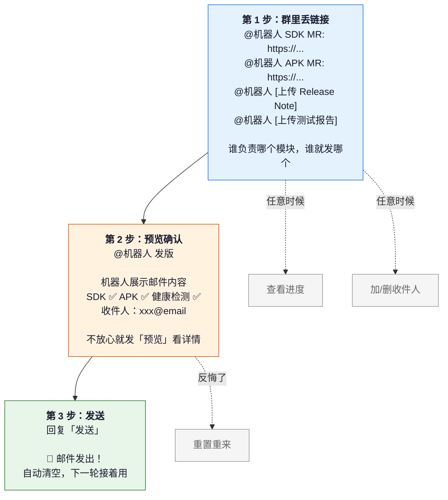
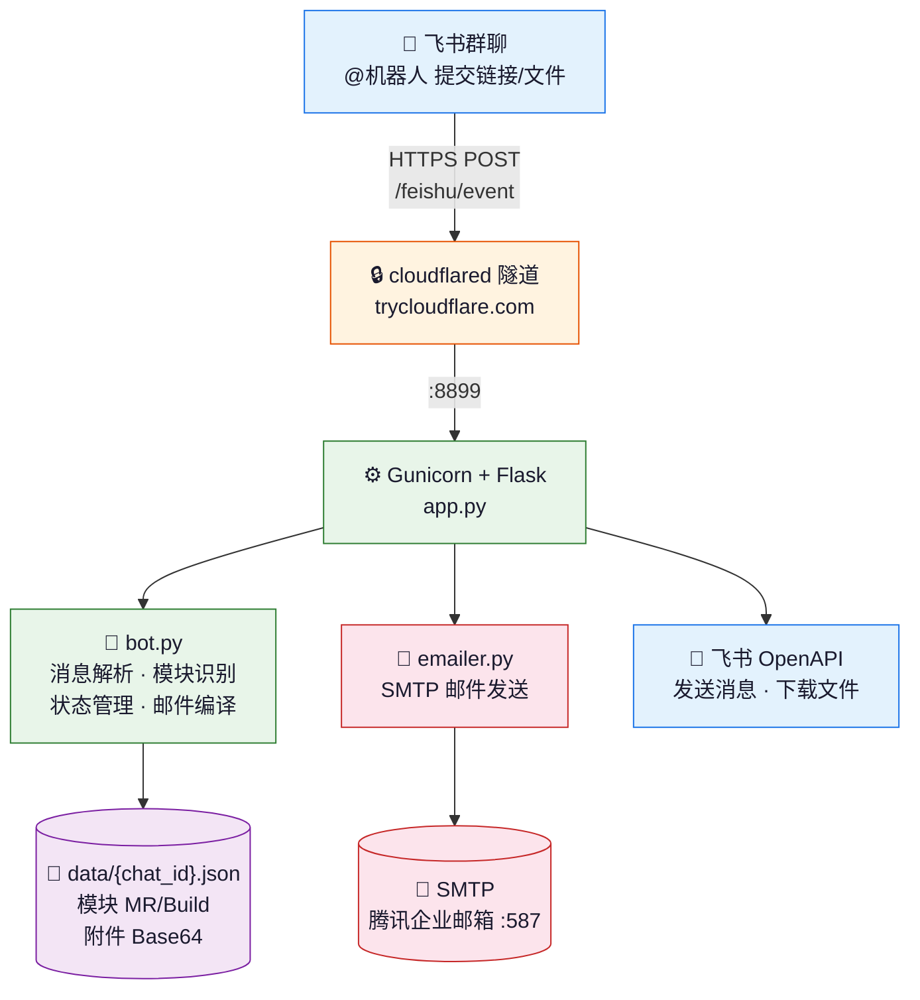
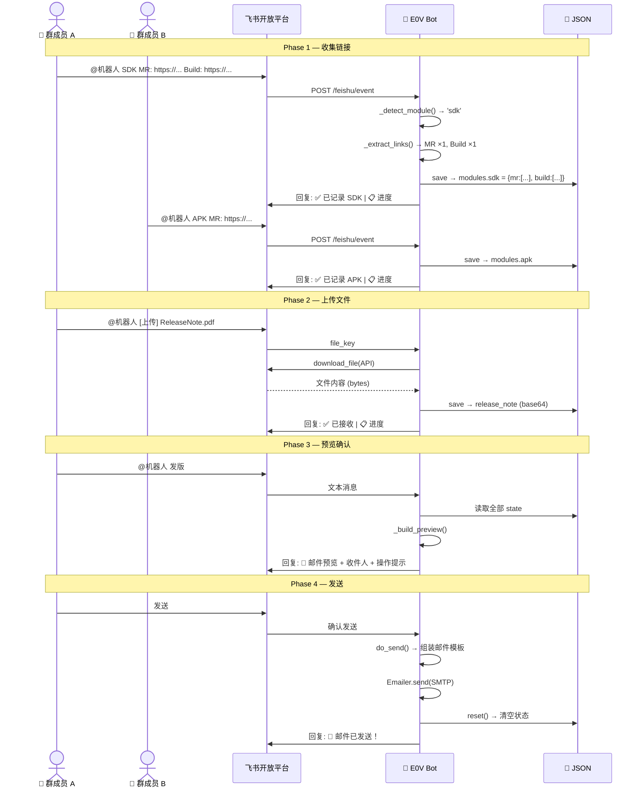

# E0V 版本释放机器人

> 🎨 **产品介绍页**: [macjacobs96.github.io/e0v-release-bot/product-page.html](https://macjacobs96.github.io/e0v-release-bot/product-page.html) — 给领导看的

飞书群聊协作模式，自动化 E0V 版本释放流程：收集 SDK / APK / 健康检测的 MR 和 Build 链接，上传 Release Note 和测试报告，一键编译发送版本释放邮件。

## 一句话说清楚

> 以前发版要在群里来回 @人收集链接、手动整理邮件；现在大家各自把链接扔群里，机器人自动收集，最后说一声「发版」就完事。


## 怎么用（就 3 步）



| 命令 | 作用 |
|------|------|
| `@机器人 <链接>` | 提交 MR/Build 链接，自动识别是 SDK/APK/健康检测 |
| `@机器人 [上传文件]` | 上传 Release Note 或测试报告 |
| `@机器人 发版` | 预览邮件 |
| `发送` | 确认发出版本释放邮件 |
| `进度` | 看看还差哪些没交 |
| `重置` | 全部清空重新来 |

## 系统架构



### 核心组件

| 文件 | 职责 |
|------|------|
| `app.py` | Flask 服务入口，事件路由 (POST /feishu/event)，@提及检测，多模块拆分 |
| `bot.py` | 核心逻辑：消息解析、两阶段模块识别、状态读写、命令处理 |
| `emailer.py` | SMTP 邮件发送，支持多收件人 + 附件打包 |
| `start.sh` | 部署启动脚本，设置环境变量，gunicorn 后台运行 |

### 模块识别 (两阶段检测)

```
1. Phase 1 — 去 URL 看「人写的文字」前缀 (高优先级)
   健康检测 > SDK > APK

2. Phase 2 — 全文回退兜底 (低优先级)
   避免 URL 中 Domain 等关键词误触
```

## 交互流程



## 命令一览

| 命令 | 作用 |
|------|------|
| `@机器人 <链接>` | 提交 MR/Build 链接，自动识别模块 |
| `@机器人 [上传文件]` | 上传 Release Note 或测试报告 |
| `@机器人 发版` | 预览版本释放邮件 |
| `发送` | 确认发送邮件 |
| `预览` | 查看完整邮件内容 |
| `进度` / `状态` | 查看当前收集进度 |
| `加收件人 xxx@email` | 添加收件人 |
| `删收件人 xxx@email` | 删除收件人 |
| `收件人` | 查看收件人列表 |
| `重置` / `清空` | 清空重新开始 |
| `帮助` | 显示使用说明 |

## 邮件模板

```
To: sunaoyu@senseauto.com, ...
Subject: E0V 版本释放通知

1. 版本释放链接
   【SDK】MR: xxx  Build: xxx
   【APK】MR: xxx  Build: xxx
   【健康检测】MR: xxx  Build: xxx

2. Release Note
   附件: ReleaseNote.pdf

3. 测试报告
   附件: 测试报告.pdf

此邮件由 E0V 版本释放机器人自动生成
```

## 部署

```bash
# 服务器: 43.159.43.36
# 路径: /root/e0v-release-bot/

# 启动
cd /root/e0v-release-bot && bash start.sh

# HTTPS 隧道 (飞书事件订阅需要)
cloudflared tunnel --url http://localhost:8899
# → 更新飞书后台「事件订阅」→「请求网址」
```

## 环境变量

| 变量 | 说明 |
|------|------|
| `FEISHU_APP_SECRET` | 飞书应用 Secret (`start.sh`) |
| `SMTP_HOST` | SMTP 服务器 (默认 `smtp.exmail.qq.com`) |
| `SMTP_PORT` | SMTP 端口 (默认 `587`) |
| `SMTP_USER` | 发件邮箱地址 |
| `SMTP_PASS` | 发件邮箱密码 |

## License

MIT
